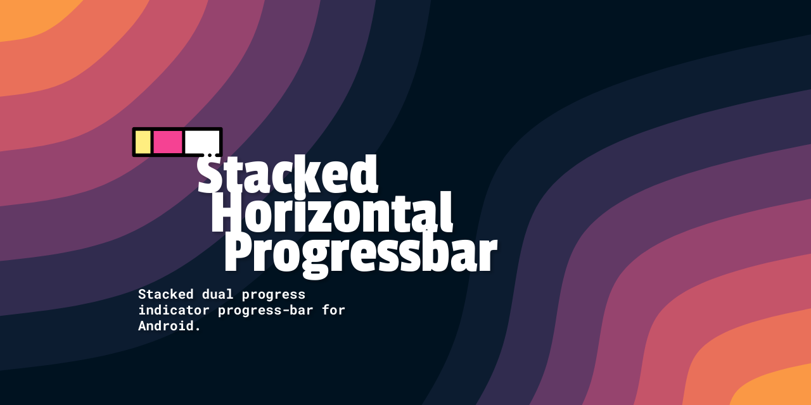

     

 

Stacked dual progress indicator progress-bar for Android.

- 📕 Usage Docs (at) https://nisrulz.com/stackedhorizontalprogressbar/

- [Changelog](Changelog.md)
- Sample App

   

- Pull Requests

    Here are some basic rules to follow to ensure timely addition of your request:

    - If its a feature, bugfix, or anything please only change code to what you specify.
    - Please keep PR titles easy to read and descriptive of changes, this will make them easier to merge :smile:
    - Pull requests _must_ be made against `develop` branch. Any other branch (unless specified by the maintainers) will get rejected.
    - Check for existing [issues](https://github.com/nisrulz/stackedhorizontalprogressbar/issues) first, before filing an issue.

- License

    Copyright 2016 Nishant Srivastava

    Licensed under the Apache License, Version 2.0, [click here for the full license](/LICENSE).

- Logo

    Credit:<a href="https://www.flaticon.com/free-icons/progress-bar" title="progress bar icons">Progress bar icons created by Freepik - Flaticon</a>
